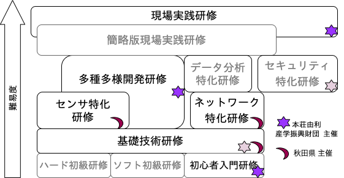

# 続IoT多種多様開発研修(2020年度版)

<Div Align="right"> 2020.12/22-23 </Div>

(詳しくはテキストをご覧下さい)

## 本研修の位置づけ


## 1.2. 時間割

| | | |
|---|---|---|
|第一日目|9:30~16:30|開発環境のセッティング 、機器製作（環境、人の往来，スイッチ操作，電力）|
|第二日目|9:30~16:30|機器製作（音，監視カメラ，M5StickC），設計手法、まとめ|
|第三日目|9:30~16:30|報告会（プレゼンテーション），相談会，閉講式|


## 1.3. 宿題

今回制作したものなどを、社内などに設置し稼働させてみてください．
第三日目の報告会にてプレゼンしていただきます．

# 2. セットアップ

本研修では座学でも随時ラズパイ等を操作して確認して頂きます。
まずは準備し起動してください。
Wi-Fiの設定については、正面のホワイトボードをご覧下さい。

- ラズパイ（ラズベリーパイ）の組み立て（箱に入っている説明書をよく読んでください）
- ラズパイの配線（電源はまだ入れない）
- ディスプレイのセットアップ
- ラズパイの電源投入
- Wi-Fi接続
- (初回のみ)ターミナルから```sudo raspi-config --expand-rootfs``` を入力し再起動 (詳しくは付録A参照)

当日配付したラズベリーパイは音が鳴りませんでした。下記をターミナルから入力すると音が鳴るように改善します。
```sudo apt purge pulseaudio pulseaudio-utils```

